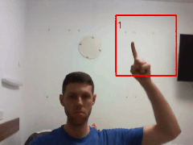
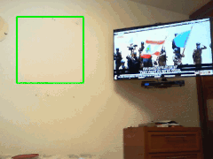
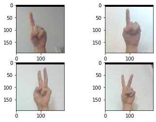
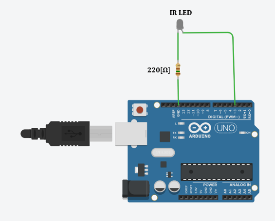

# Gesture Control With DNN Model
<h2>Description</h2>

  This project implements a gesture TV control.
  The algorithm can classify two hand gesture when placing the hand in the green window. The first gesture change the channel forward,     the second gesture changes the channel backward.
  I used arduino UNO to control the TV.
  For now the gesture classification works only with white background.

  

<table>
  <tr>
    <td>Algorithm Example</td>
    <td>Channel Changing</td>

  </tr>
  <tr>
    <td></td>
    <td></td>

  </tr>
 </table>

  <h2>Model</h2>
  I used MobileNetV2 as a foundation to the model with imagenet weights.  I removed the last 1000 neuron layer and disabled training of     the other layers.
  I added a few more layers (later I will train them) and I achieved the final model:
  <pre>
    base_model = MobileNetV2(weights = 'imagenet', include_top=False)
    x=base_model.output
    x=GlobalAveragePooling2D()(x)
    x=BatchNormalization()(x)
    x = Dense(3, activation='softmax')(x)
    model = Model(inputs=base_model.input, outputs=x)
  </pre>

  

  <h2>
    Data And Training
  </h2>
  
  
  <table>

  <tr>
    <td width=40%>
      
      <h6 style="text-align:center">
        An example of the data-set
      </h6>
  
  </td>
    <td>
      I took 500 photos of each class and labeled them. The model expect to get images with shape of 224X224X3, so I had to resize each           photo before using it. Finally I used keras method preprocess_input(). To solve the dimension problem I used numpy. The following function prapering images as needed:
      <pre>
        def prepar_image(img):
          x=cv2.resize(img,(224,224))
          x=image.img_to_array(x)
          x=np.expand_dims(x,axis=0)
          x=preprocess_input(x)
          return x
      </pre>
  The model was compiled with the following parameters: optimizer='adam',loss='categorical_crossentropy. Model accuracy was over 90%.
  </td>
  </tr>  
 </table>

  

  <h2>
    Circuit 
  </h2>
  
  <h3>Required Components</h3>
  <ul>
    <li>Arduino UNO</li>
    <li>220 Ohm resistor</li>
    <li>IR LED</li>
  </ul>

  <h2>Python Libraries Needed</h2>
  <ul>
    <li>cv2</li>
    <li>numpy</li>
    <li>Tensorflow</li>
    <li>keras</li>
    <li>serial</li>
  </ul>
  
  <h2>Arduino Libraries Needed</h2>
  <ul>
    <li>IRremote.h (by shiriff)</li>
  </ul>

  <h2>
    How To Use  
  </h2>

  <ul>
    <li>
      First build the circuit, then connect the Arduino UNO to the computer. Open the Arduino program-"arduino_main.ino" which             located in "arduino" folder and update in the program your required remote signal.    
       For more information to how connect arduino to the computer click <a href="https://www.arduino.cc/en/main/howto">here.</a> 
       To find your required signal click <a href="https://www.youtube.com/watch?v=8E3ltjnbV0c&t=1443s">here.</a>  
      </li>
    <li>
      Run the main.py program (the Arduino UNO have to be connected to the computer)
   </li>

  </ul>
   <h2>Enjoy!</h2>

  
  
           
